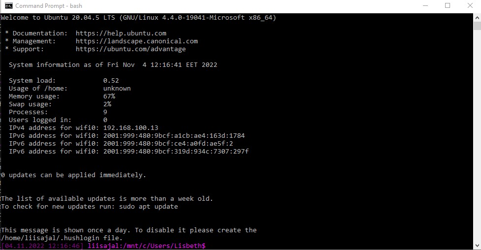

## Introduction to the course Command-Line Tools for Linguists 2022

The course's purpose was to get to know the command-line environment and it teached the basic use of command-line tools, with an emphasis on how it can be utilized for the purposes of linguistics.

The course was divided into 7 weeks (+ a final assignment) and each week had its own theme and assignments on the topic of the week.

Below I have briefly described the main content of each week with some reflection on what we learned during each week.

### Week 1: Introduction to Command Line Environments

For the 1st week we were to set up the Command Line Environment on our computer. I didn't have to do this because I already had used the Command Line Environment on previous courses.

We became familiar with a lot of basic commands, such as **ls**, **pwd**, **cd** and **mkdir**.

> ##### *Command to create a directory:*
>
> mkdir example_directory

There were a lot of different basic commands to learn on the 1st week and thus it felt a bit overwhelming at times. Luckily there was a "cheat sheet" for these so I could come back to them on the weeks to follow.   

Perhaps the most confusing thing on the 1st week for me was the use of text editor **emacs**. Its commands were so different to what I was used to and I struggled surprisingly much in just **closing** it. Luckily **emacs** became a little bit more familiar in the following weeks.

### Week 2: Navigating a UNIX System

On this week there were **3 themes**:

The **1st** theme was the UNIX file system in general and how it is organized. We learned commands to **copy**, **move** and **delete** files and directories. We also learned how the UNIX system protects the privacy of the users. This is done by granting each user permissions which then determine what files and directories they can actually access. These permission options are listed in the table below.

| Permission Type        | Symbol  |
| ---------------------- |:-------:|
| No Permission          |    –    |
| Execute                |   -x    |
| Write                  |   -w-   |
| Execute + Write        |   -wx   |
| Read                   |   r–    |
| Read + Execute         |   r-x   |
| Read + Write           |   rw-   |
| Read + Write + Execute |   rwx   |

On the **2nd** part of the week we learned what is actually happening "behind the scenes" when we execute a program or a command and thus starting a new process. We learned how to control processes from the command line.

The **3rd** theme was remote servers and working on them. We tried this by connecting to the CSC's supercomputer **Puhti** using a remote terminal.  

### Week 3: Basic Corpus Processing

This week we learned to process text files using the text processing tools found in UNIX. We learned commands to help uncover **linguistically relevant** information in the text files, such as **wc**, **head** and **tail**.

We also learned about different character encodings and converting files from one encoding to the other.

##### Some commonly used character encoding formats:

  * UTF-8 (Unicode Transformation-8-bit)
  * Latin-1
  * ASCII

> ##### **The command to turn a Latin-1 file into UTF-8 file:**
>
> iconv -f latin1 -t utf-8 file.txt > file.utf8.txt

One important thing we learned is that UNIX and DOS (Windows) text files are different. They mark the end of a line in a text file differently and thus the files can either have extra characters or lose their line ends, depending on are you trying to view a UNIX file in Windows or vice versa. This is why we need to either convert the files to either UNIX or DOS before we can work with them.

> ##### **Command to convert a Windows file into UNIX file:** 
>
> dos2unix mywindowsfile.txt

> ##### **Command to convert a UNIX file into Windows file:***
>
> unix2dos myunixfile.txt

We also learned some simple Regular Expressions and the **grep** command to search for lines in text files. 

### Week 4: Advanced Corpus Processing

In this week we dug a little deeper into processing corpora using UNIX commands. We combined the simpler commands we learned the previous week into more complex **pipelines**. We learned also more about regular expressions and using them with the command **sed** (short for *stream editor*) which is used to edit text files quickly without even opening them. **Sed** is most commonly used to substitute patterns with new strings

> ##### **An example of using sed to change all the words "cat" in the "old" file to "dog" in the "new" file:**
>
> sed s/cat/dog/ old > new

### Week 5: Scripting and Configuration Files

This week we learned to transform the commands we learned from the previous 2 weeks into **scripts** which can be used to solve more complex problems. A **script** basically works the same way as the command you would write to the command-line but it is stored as a text file that can be **executed** and it's usually much simpler and faster to use.

> ##### **An example of a very simple script:**
>
> #!/bin/bash
>
> #A script to print "Hello World!"
>
> echo Hello World!

### Week 6: Installing and Running Programs

jsjsjjs

### Week 7: Version Control

sksklaskala

### Final Assignment: Building Webpages using GitHub Pages

s,lsalalkalk 