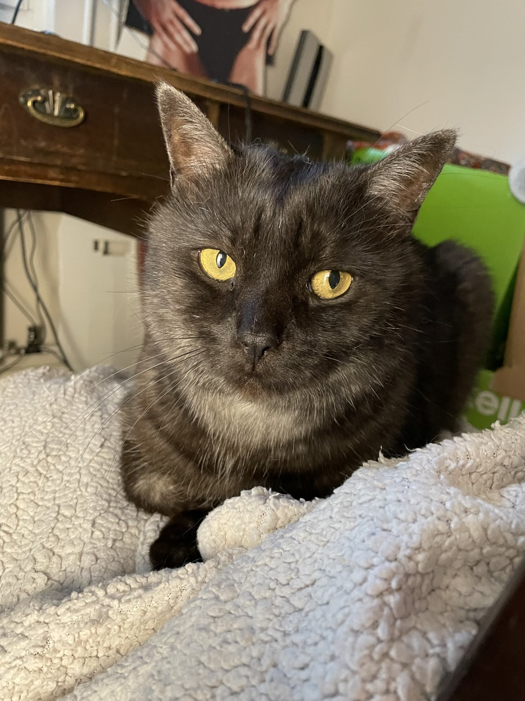
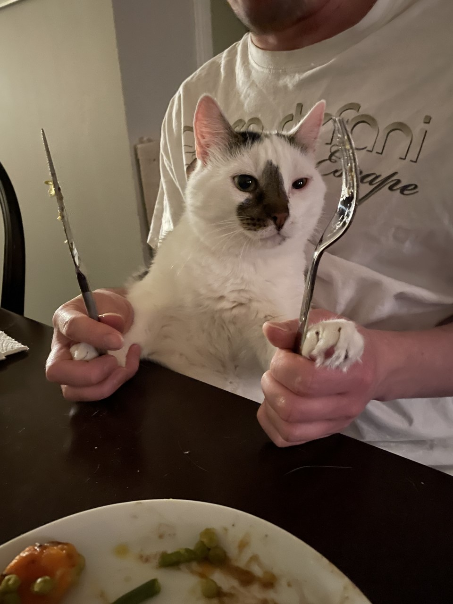
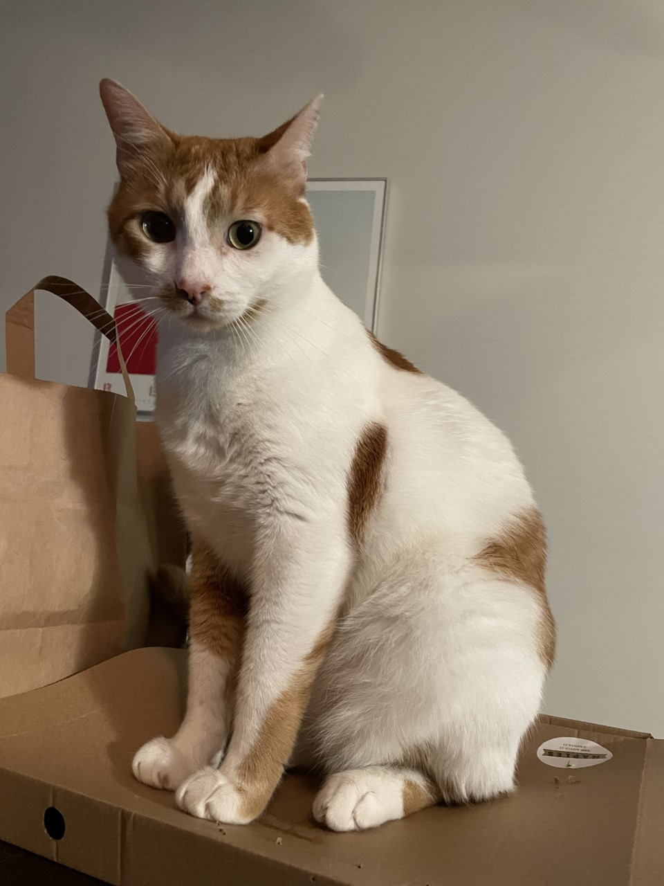
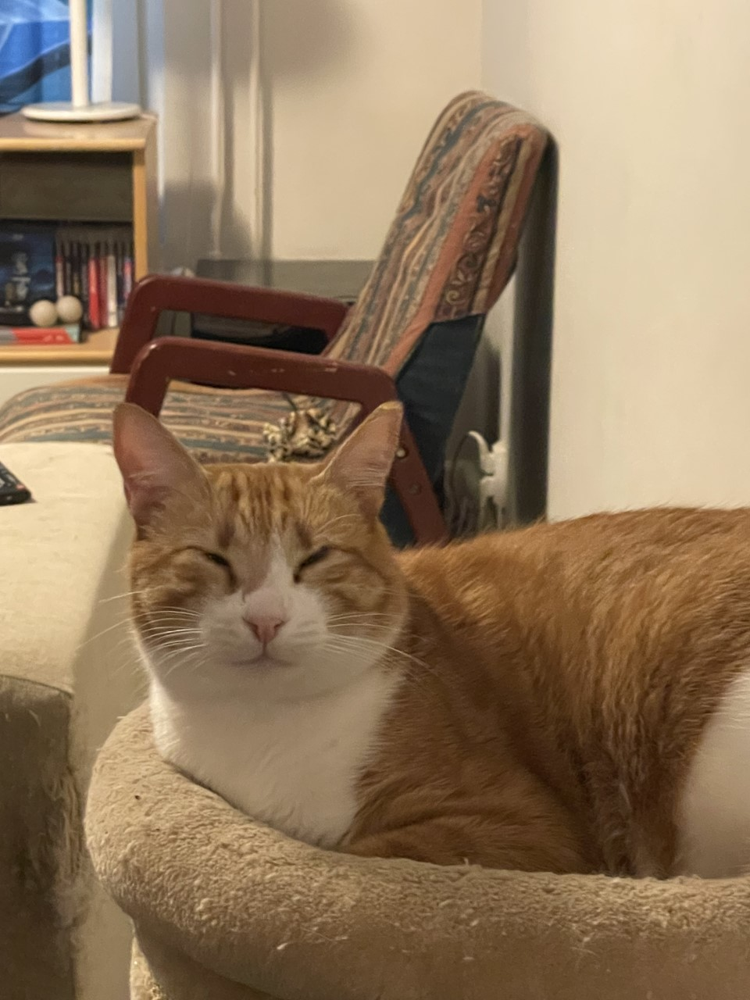

## Introduction

I am Liisa Jalkanen and I study Computer Science and Linguistics at the University of Helsinki.

I am a Crazy Cat Lady with 4 rescue cats and you can see the pictures of my cats below in their own [section](#my-cats) with some basic info of them. 

My hobbies include:
  * Pole dancing
  * Drinking beer and tapping them on Untappd
  * Spending time with my cats
  * Kissing my cats on their small soft foreheads
  * Taking pictures of my cats
  * Talking about my cats

## My cats

## Find me on

[GitHub](https://github.com/lisja/lisja.github.io)

[Instagram](https://www.instagram.com/department_of_purrlogy/)

[Untappd](https://untappd.com/user/dear_jimmy)

## Contact

My email address is liisa.jalkanen@helsinki.fi 

P.s. Please hesitate to contact me.

## Some of the courses I've taken in the year 2022

[Introduction to Cognitive Science](https://studies.helsinki.fi/courses/cur/otm-b2217fd0-550c-4ac1-bf50-58fdbaa85250), summer 2022

[Oral Skills in the Second National Language, Swedish](https://studies.helsinki.fi/courses/cur/hy-opt-cur-2223-ab44cc15-a1e3-44f7-8453-7039f750d8b3/KK-RUERI/Toisen_kotimaisen_kielen_suullinen_ja_kirjallinen_taito_ruotsi_CEFR_B1_periodi_I_r1_Lectures), fall 2022

[Written Skills in the Second National Language, Swedish](https://studies.helsinki.fi/courses/cu/hy-CU-117995649-2022-08-01/KK-RUKIRJ/Written_Skills_in_the_Second_National_Language_Swedish_CEFR_B1_), fall 2022

[Command Line Tools for Linguists](https://studies.helsinki.fi/courses/cu/hy-CU-134651633-2021-08-01), fall 2022

## Projects

[My GitHub project for the course Command-Line Tools for Linguists 2022](https://github.com/lisja/cmdline-course)

## Misc. 

Funny Instagram Pages About Cats and Cat Memes:

[ICanHasCheezburgerz](https://www.instagram.com/icanhascheezburgerz/)

[cattosbeingcattos](https://www.instagram.com/cattosbeingcattos/)